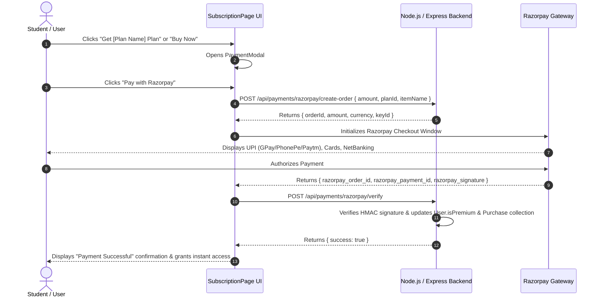

# Subscription Tab & Pricing Architecture Analysis

## 1. Executive Summary

The **Subscription & Pricing System** in the competitive exam platform provides students with flexible, tiered access to full-length mock tests, subject-wise practice tests, PYQ E-Books, live classes, and video course libraries.

It serves a dual purpose:
1. **Public Portal (`/subscription`)**: Presents a responsive pricing catalog with **Monthly / Yearly billing toggles**, **Tiered Subscription Plans** (Starter, Pro, Super), **One-Time Combo Packs**, and an **Instant Razorpay Payment Checkout Modal**.
2. **User Profile Dashboard (`/profile?tab=purchase`)**: Displays the candidate's active membership status, full purchase history, subscription validity end dates, and printable **Official Tax Invoice Receipts**.

---

## 2. Frontend Architecture & Components

```
frontend/src/
├── pages/
│   ├── SubscriptionPage.jsx      # Public subscription catalog, plan toggle, and payment modal
│   └── UserProfilePage.jsx       # Student profile dashboard with "Purchase & Orders" tab
└── admin/
    └── pages/
        ├── SubscriptionsManager.jsx # Admin management of active plans & subscribers
        └── Subscription.jsx        # Admin plan configuration
```

### Key UI Capabilities:
- **Billing Period Switcher**: Interactive toggle for `Yearly` vs `Monthly` billing.
  - **Yearly Plan Discount**: Automatically calculates a **~40% discount** when switching to yearly billing.
- **Dynamic Configuration & Fallbacks**: Fetches live plan configurations from `GET /api/subscription-config/public`. If the server is unreachable or offline, it gracefully falls back to predefined fallback structures (`DEFAULT_MONTHLY`, `DEFAULT_YEARLY`, `DEFAULT_COMBOS`).
- **Feature Checklists**: Renders clear visual indicators (`FaCheck` for included features, `FaTimes` for excluded features) per plan tier.
- **Visual Tier Demarcation**:
  - **Starter**: Entry-level test practice.
  - **Pro**: "Most Popular" highlighted card with gradient border.
  - **Super**: "Best Value" tier with full access to live classes, recordings, doubt clearing, and deep analytics.
- **Combo Packs**: Standalone one-time purchase cards (e.g., *PDF Course Bundle*, *Test Series Pack*, *Live Batch + Materials*, *All-in-One Super Plan*).

---

## 3. Razorpay Payment Workflow

The payment process handles both single-time purchases and subscription activations through Razorpay API integrations:



---

## 4. Backend Data Models & API Infrastructure

### 4.1 Data Models

#### `User` Model (`backend/src/models/User.js`)
```json
{
  "isPremium": true,
  "isSubscribed": true,
  "subscription": {
    "name": "Pro Package Membership",
    "price": 1499,
    "validUntil": "28 Jul 2027"
  }
}
```

#### `Purchase` Model (`backend/src/models/Purchase.js`)
```json
{
  "orderId": "ORD-1785289900-8A3X",
  "student": "ObjectId(User)",
  "productType": "subject",
  "productName": "Odisha Exams Unlimited Pro Pass",
  "amount": 499,
  "finalAmount": 499,
  "status": "completed",
  "razorpayOrderId": "order_Px910283",
  "razorpayPaymentId": "pay_Px910294",
  "createdAt": "2026-07-28T16:00:00Z"
}
```

### 4.2 API Routes Summary

| Endpoint | Method | Access | Description |
| :--- | :--- | :--- | :--- |
| `/api/subscription-config/public` | `GET` | Public | Fetches active subscription plans, prices, and combos |
| `/api/payments/razorpay/create-order` | `POST` | Protected | Initializes Razorpay order and returns transaction ID |
| `/api/payments/razorpay/verify` | `POST` | Protected | Verifies payment signature and upgrades user account |
| `/api/orders/my-purchases` | `GET` | Protected | Returns candidate's order history, active plan, and expire dates |
| `/api/subscriptions/plans` | `GET/POST` | Admin Only | Admin CRUD operations for managing subscription tiers |

---

## 5. User Profile Integration (`/profile?tab=purchase`)

When candidates navigate to their **UserProfilePage**:
1. **Header Card**:
   - Displays a **Premium Student Member** badge with a crown icon if `isPremium` or active subscription exists.
   - Shows active plan name and validity expiration date (*Valid until: 28 Jul 2027*).
2. **Purchase & Orders Tab**:
   - Fetches `/api/orders/my-purchases` on component mount.
   - Displays a clean data table containing **Order ID**, **Item Name**, **Type**, **Purchase Date**, **Expire Date**, **Amount**, **Status**, and **View Bill**.
3. **Digital Tax Invoice & Receipt Modal**:
   - Displays official billing details including **Billed To**, **Order ID**, **Bill No**, **Purchase Date**, **Expire Date**, **GST (18% Included)**, and **Payment Method**.
   - Includes an instant **Print / Save PDF** action.

---

## 6. Strength & Architecture Assessment

| Feature | Assessment | Status |
| :--- | :--- | :--- |
| **Responsive UI & Aesthetics** | Modern glassmorphism design with color-coded tiers | ✅ Implemented |
| **Fail-Safe Offline Mode** | Graceful fallback to default Starter/Pro/Super structures | ✅ Implemented |
| **Razorpay Integration** | Secure SDK initialization, HMAC verification, and test mode support | ✅ Implemented |
| **Live User Profile Sync** | Instant order & bill fetching via REST APIs | ✅ Implemented |
| **Validity & Expiry Tracking** | Calculates and displays 1-year validity expiration dates | ✅ Implemented |

---

## 7. Recommendations for Future Enhancements

1. **Auto-Recurring Billing**: Integrate Razorpay Subscriptions API for automatic monthly/yearly auto-renewal.
2. **Coupon Code Input**: Add a promo code input box in `PaymentModal` to apply instant discounts before creating Razorpay orders.
3. **Invoice PDF Download**: Add server-side PDF generation (e.g. via `pdfkit` or `puppeteer`) for downloading formal invoice PDFs.
