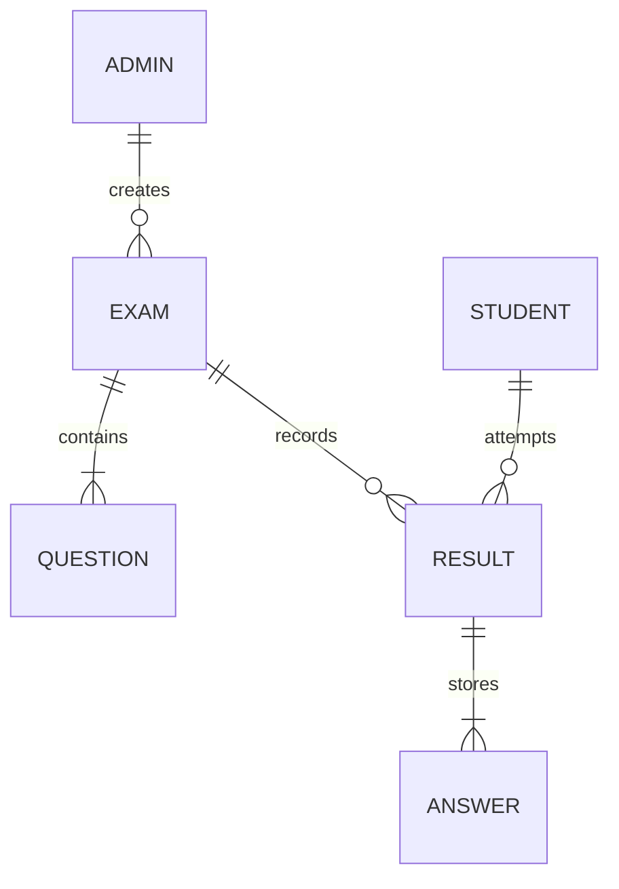
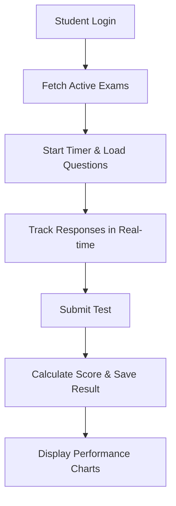

# Online Examination System: Architecture & Workflow

This document outlines the technical architecture and operational workflow of the Adda247-style Online Examination System.

---

## 🏗️ System Architecture

The system follows a modern **three-tier architecture** with a decoupled frontend and backend.

### 1. Presentation Layer (Frontend)
- **Framework**: React.js (built with Vite)
- **Styling**: Vanilla CSS with custom design tokens for a premium, Adda247-like aesthetic.
- **State Management**: 
  - **AuthContext**: Manages Admin and Student sessions.
  - **ExamContext**: Handles real-time exam logic (countdown timer, question navigation, response tracking).
- **Libraries**: Lucide-React (icons), Chart.js (performance analytics), Axios (API communication).

### 2. Application Layer (Backend)
- **Runtime**: Node.js
- **Framework**: Express.js
- **Authentication**: JWT (JSON Web Tokens) for secure Admin access.
- **Features**: 
  - RESTful API endpoints for Auth, Questions, Exams, and Submissions.
  - Automatic score calculation and negative marking logic.
  - Initial admin seeding.

### 3. Data Layer (Database)
- **Database**: MongoDB (NoSQL)
- **Object Modeling**: Mongoose
- **Schemas**: 
  - `Admin`: Credentials for test management.
  - `Student`: Profile information (Name, Roll, Branch, Section).
  - `Question`: Text, options, correct answer, section, and marks.
  - `Exam`: Title, duration, and associated questions.
  - `Result`: Attempt details, section-wise scores, and time taken.

---

## 📈 System Workflow

### A. Admin Workflow (Management)
1. **Authentication**: Admin logs in via the secure portal.
2. **Question Bank**: Admin adds questions (English, Reasoning, Quant) to the central repository.
3. **Exam Creation**: 
   - Admin defines exam title and duration.
   - Admin selects specific questions from the bank for the new test.
4. **Monitoring**: Admin views registered students and monitors performance across all attempts.

### B. Student Workflow (Examination)
1. **Registration/Login**: Student enters details (Name, Roll, Branch, Section).
2. **Exam Environment**:
   - Student enters the pixel-perfect Adda247-style interface.
   - **Persistence**: If the student refreshes, the timer and answers are restored.
3. **Interaction**:
   - Student navigates questions via the palette or navigation buttons.
   - Mark for Review and Clear Response features allow flexible answering.
4. **Submission**: 
   - Student submits the test (or auto-submit triggers when the timer ends).
5. **Results & Analysis**: 
   - System instantly calculates the score with negative marking.
   - Student views detailed performance charts and subject-wise breakdown.

---

## 🗄️ Database Schema Diagram

---

## 🌐 API Flowchart

